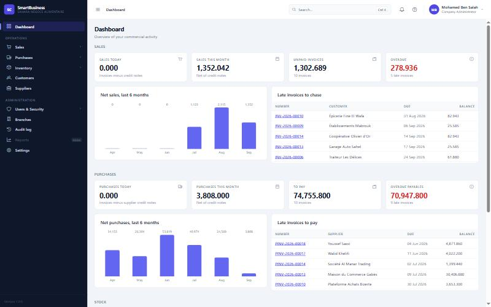
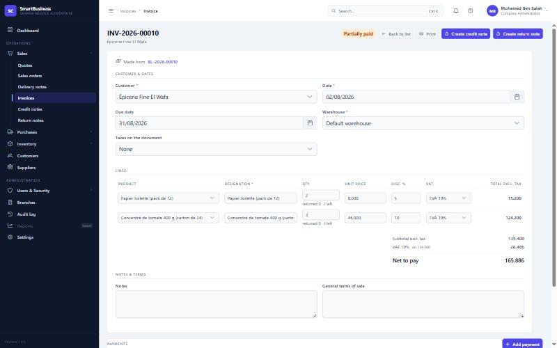
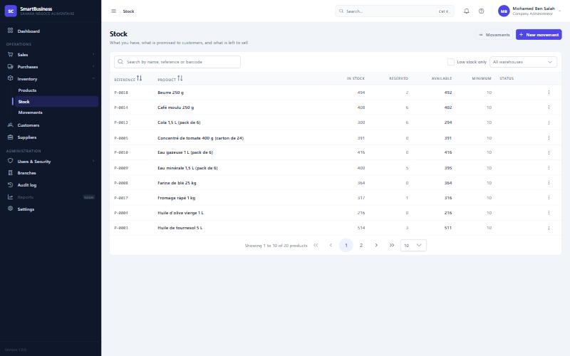
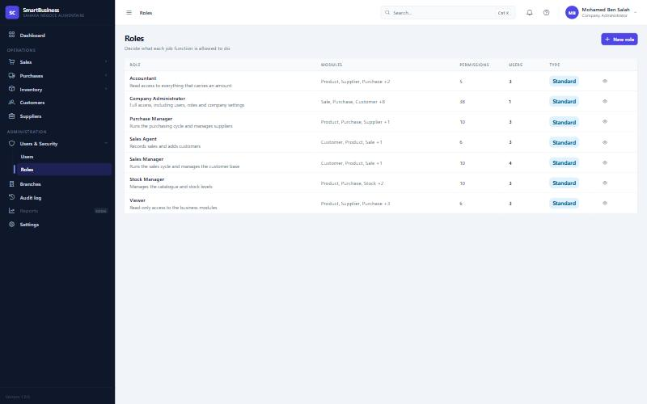

# SmartBusiness

A complete mini ERP for commercial management — not a CRUD demo: quote → order → delivery → invoice
→ payment, purchasing as an exact mirror, stock, dashboard, multi-company RBAC, and about thirty
business rules that make an ERP hard (tax rounding, derived statuses, concurrency, per-company
isolation).

**Backend** Java 21 / Spring Boot 4 · **Frontend** Angular 19 / PrimeNG · **Database** PostgreSQL + Flyway
**785 backend tests · 451 frontend tests**, all green.

---

## Preview

| | |
|---|---|
|  |  |
|  |  |

*(see [docs/screenshots/](docs/screenshots/) for more)*

---

## What the application covers

**Sales** — customers, quotes, orders, delivery notes, invoices, credit notes, return notes,
payments; every document tracks the remainder of what has been delivered/returned, line by line.
**Purchasing** — the exact mirror on the supplier side (order → receipt → invoice → credit note →
return).
**Stock** — entries/exits/transfers/adjustments, reserved vs. available, alert thresholds.
**Catalogue** — products, categories, brands, taxes (VAT, FODEC, stamp duty — Tunisian tax rules).
**Security** — accounts, per-company roles and permissions, business modules that can be
switched on/off, account lockout after failed attempts, a full audit log (who did what, when).
**Multi-tenant (SaaS-ready)** — every company is isolated server-side (never on the client), with a
separate platform portal to manage accounts.
**Dashboard** — net revenue, unpaid amounts, overdue items, stock value, the last 6 months.
**Printing** — a single sheet for every document type (invoice, quote, note...), PDF export.

## What makes this project worth reading

- **A single generic document engine** (`common/DocumentTotals`) computes every sales and purchase
  document — never copy-pasted, never recalculated on the client.
- **Stock is an append-only ledger** of signed movements, never a counter that gets incremented —
  corrected by a reverse movement, never by a direct edit.
- **An invoice's settlement is derived** from the sum of its payments and credit notes on every
  write — there is no "mark as paid" button.
- **Two critical races were found and fixed, each with a test that proves the bug** before the
  fix: selling the last units of a product twice at once, delivering the same remainder of an order
  twice. A row lock (`PESSIMISTIC_WRITE`) on both sides.
- **RBAC is enforced server-side, not just displayed**: switching off a company's module removes the
  matching permissions on the very next request, with no redeploy.
- **785 backend tests** (unit, `@WebMvcTest`, end-to-end integration against a real Postgres
  database recreated on every run) **+ 451 frontend tests** (Karma/Jasmine).

Full detail and reasoning: [`docs/ARCHITECTURE.md`](docs/ARCHITECTURE.md).

## Tech stack

| Layer | Technology |
|---|---|
| Backend | Java 21, Spring Boot 4.0.7, Maven |
| Security | Spring Security, JWT (HS384), account lockout |
| Database | PostgreSQL 15, Flyway (29 versioned migrations) |
| ORM | Spring Data JPA / Hibernate |
| Mapping | MapStruct |
| Frontend | Angular 19.1, Standalone Components, Signals |
| UI | PrimeNG 19 (Aura theme) — the project's only UI library |
| Forms | Reactive Forms |

## Quick start

### Prerequisites
Java 21 · Node.js 20+ · PostgreSQL 15+ · Maven 3.9+

### Backend

```bash
# 1. Database
psql -U postgres -c 'CREATE DATABASE "smartBusiness";'

# 2. smartBusiness_backend/src/main/resources/application.properties
#    (or the DB_USERNAME / DB_PASSWORD environment variables)

# 3. Start — Flyway applies the migrations automatically
cd smartBusiness_backend
mvn spring-boot:run
```
The API starts on `http://localhost:8080`.

### Frontend

```bash
cd smartBusiness_frontend
npm install
npx ng serve
```
The application starts on `http://localhost:4200`.

### Tests

```bash
cd smartBusiness_backend && mvn test    # 785 tests — recreates its own database on every run
cd smartBusiness_frontend && ng test    # 451 tests — Karma/ChromeHeadless
```

## Project structure

```
smartBusiness/
├── docs/                            Technical and business documentation
│   ├── PROJECT.md                   Context and objectives
│   ├── ARCHITECTURE.md              Architecture, design patterns, database
│   ├── RBAC.md                      Permissions, roles, per-company isolation
│   ├── DEVELOPMENT.md               Coding conventions
│   ├── UI-UX.md                     PrimeNG design system
│   ├── ROADMAP.md                   Detailed history of every phase
│   └── screenshots/                 Screenshots for this README
├── smartBusiness_backend/           Spring Boot API — feature-based (27 modules)
│   └── src/main/java/com/sales/smartBusiness/
│       ├── sales/ purchase/         The generic document engine (quote → invoice...)
│       ├── stock/                   Append-only movement ledger
│       ├── payment/ supplierpayment/  Settlement registers
│       ├── role/ user/ company/     RBAC, business modules, per-company isolation
│       ├── audit/                   Audit log
│       └── platform/                SaaS portal (managing customer companies)
└── smartBusiness_frontend/          Angular application — 16 features, one service per domain
```

## Documentation

| Document | Content |
|---|---|
| [PROJECT.md](docs/PROJECT.md) | Business context and objectives |
| [ARCHITECTURE.md](docs/ARCHITECTURE.md) | Architecture, technical decisions, database |
| [RBAC.md](docs/RBAC.md) | Permissions, roles, per-company isolation |
| [DEVELOPMENT.md](docs/DEVELOPMENT.md) | Coding conventions and gotchas encountered |
| [UI-UX.md](docs/UI-UX.md) | PrimeNG design system |
| [ROADMAP.md](docs/ROADMAP.md) | Detailed history, phase by phase |

---

*Designed and driven by me end to end: I defined the business scope, the architecture, every
business rule (document calculation, settlement derivation, concurrency locks, RBAC...), and I
reviewed, tested and validated every change before accepting it. Claude Code was used as a coding
assistant for the implementation — the same way an IDE or a code copilot would be, not as the
project's author. The detailed phase-by-phase history is in [ROADMAP.md](docs/ROADMAP.md).*
